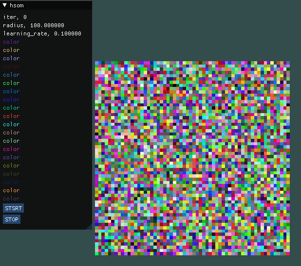
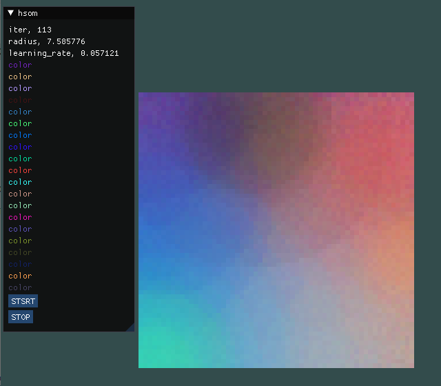
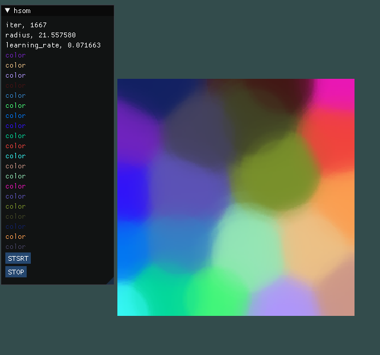
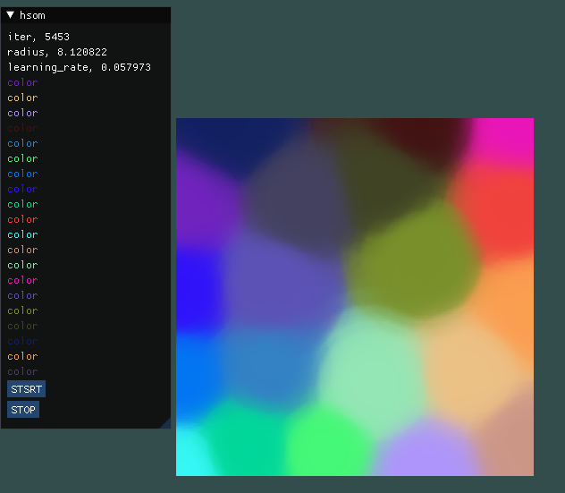

# Histogram Self-Organizing Map Color Demo

###### 第一次嘗試HSOM ######

### 初始化
* lattice是60 * 60隨機生成的亂數顏色
* inputdata也是隨機生成的20種顏色
* 總迭代次數為10000
* 畫面
    * 左邊顯示目前的迭代次數、收縮半徑、學習比率
    * 顯示所有input color
    * 有按鈕開始即暫停
    
    
### 開始執行

* 拓展level適用interpolation去操作 

| level    | iter      |
| -------- |:---------:|
| 60       | 200       |
| 180      | 5000      |
| 540      | 10000     |

### 結果

在迭代1500次的時候就已經差不多了

